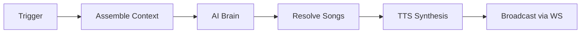

<div align="center">


# Aurio

### Your personal AI radio · 你的私人 AI 电台

**It reads your calendar, weather, and taste — then hosts a real show from your libraries.**  
**它读你的日程、天气和品味 —— 然后从你的曲库里，主持一场真正的电台节目。**

<br />

[](LICENSE)
[](package.json)
[](package.json)
[](web/package.json)
[](#--quick-start--快速开始)
[](https://github.com/baogutang/aurio/actions)

<br />

**[English](#english)** · **[中文](#中文)** · **[Quick Start](#--quick-start--快速开始)** · **[API Relay](#-recommended-api-relay--推荐-api-中转站)** · **[Screenshots](#-screenshots--界面一览)** · **[Architecture](#-architecture--架构)**

<br />

<!-- ═══ API RELAY — most visible placement ═══ -->
<table>
<tr>
<td width="56" align="center"></td>
<td>

**🚀 Recommended API Relay · 推荐 API 中转站**

Plug Aurio's brain into a stable OpenAI-compatible endpoint — no infra to babysit.

将 Aurio 的「大脑」接入稳定可用的 OpenAI 兼容接口，开箱即用。

<br />

<a href="https://token.baogutang.top"></a>
&nbsp;
<a href="https://token.baogutang.top"></a>

<br /><br />

<sub>
In <b>Settings → Brain · AI → API Key</b>, set <code>Base URL</code> to your relay endpoint and paste your key.<br />
在 <b>设置 → 大脑 · AI → API Key</b> 中填入中转站 <code>Base URL</code> 与密钥即可。
</sub>

</td>
</tr>
</table>

<br />


<br />

<sub>420 × 760 player · Electron desktop · browser PWA · dark / light themes<br />420 × 760 播放器 · Electron 桌面 · 浏览器 PWA · 深色 / 浅色主题</sub>

</div>

---

## Demo · 产品演示

<div align="center">


<br />

<sub>Standby → On-air playback → Chat → Settings → AI brain<br />待机 → 播出 → 对话 → 设置 → AI 大脑</sub>

<br /><br />

<picture>
  <source media="(min-width: 900px)" srcset="assets/demo-strip.png" />
  
</picture>

</div>

---

<a id="english"></a>

## English

### The idea

Streaming apps optimize for engagement. Playlists demand curation. **Aurio is neither** — it is a **local-first AI DJ** that:

- Pulls **real tracks** from Navidrome, NetEase Cloud Music, and QQ Music
- Reads **your** taste files, calendar, and weather before every segment
- Speaks between songs with cached TTS — like a radio host, not a chatbot
- Runs on **your machine** — CLI brain or your own API key

### What makes it different

| | Streaming algorithms | Aurio |
|---|---------------------|-------|
| **Music** | Opaque catalog | Your NAS + NetEase + QQ |
| **Personality** | None | `user/taste.md` + DJ persona |
| **Context** | Opaque | Calendar · weather · time-of-day |
| **Voice** | None | System / Tencent / Fish TTS |
| **Privacy** | Cloud-first | Local server, loopback API by default |

### Core capabilities

| | Feature | What it does |
|---|---------|--------------|
| 🧠 | **AI DJ Brain** | Claude / Codex CLI **or** OpenAI-compatible API (GLM, DeepSeek, Kimi, OpenAI, Anthropic…) |
| 🎵 | **Multi-source Music** | Navidrome · NetEase (QR login) · QQ — unified search, queue, lyrics |
| 🎙️ | **Voice Synthesis** | macOS `say` · Windows SAPI · Tencent Cloud · Fish Audio — disk-cached |
| 📅 | **Context Engine** | Weather, macOS Calendar, ICS feeds woven into every segment |
| ⏰ | **Scheduled Show** | 07:00 daily plan · 09:00 morning open · hourly mood 10–23 |
| 💬 | **Chat to Steer** | *"来点爵士"* — enqueue, steer mood, or talk-only |
| 📻 | **Radio Engine** | WebSocket heartbeat auto-refills queue when tracks run low |
| 🔊 | **UPnP Cast** | Stream to DLNA speakers on your LAN |
| 🛡️ | **Secure by default** | Control API + WS loopback-only; media proxies LAN-reachable for casting |
| 🖥️ | **Cross-platform** | Electron shell + same PWA in any browser |

---

<a id="中文"></a>

## 中文

### 核心理念

流媒体推算法，歌单靠手搓。**Aurio 走第三条路** —— 本地优先的 **AI 电台主持人**：

- 从 Navidrome、网易云、QQ 音乐拉 **真歌**，不是假 playlist
- 每次口播前读取 **你的** 品味文档、日历、天气
- 曲目之间开口说话，TTS 本地缓存 —— 是电台，不是聊天机器人
- **跑在你自己的电脑上** —— CLI 登录或自带 API Key

### 和常见方案的区别

| | 流媒体算法 | Aurio |
|---|-----------|-------|
| **曲库** | 平台黑盒 | 你的 NAS + 网易云 + QQ |
| **人格** | 无 | `user/taste.md` + DJ 人设 |
| **上下文** | 不透明 | 日历 · 天气 · 时段 |
| **口播** | 无 | 系统 / 腾讯 / Fish 语音合成 |
| **隐私** | 云端优先 | 本地服务，控制面默认仅 localhost |

### 核心能力

| | 功能 | 说明 |
|---|------|------|
| 🧠 | **AI 大脑** | Claude / Codex CLI **或** OpenAI 兼容 API |
| 🎵 | **多音源** | Navidrome · 网易云（扫码登录）· QQ — 统一搜索、队列、歌词 |
| 🎙️ | **语音合成** | macOS `say` · Windows SAPI · 腾讯云 · Fish Audio |
| 📅 | **情境感知** | 天气、系统日历、ICS 订阅注入每次口播 |
| ⏰ | **定时节目** | 07:00 日计划 · 09:00 早安 · 10–23 整点心情 |
| 💬 | **对话点播** | 「来点爵士」— 插播、换 mood、纯聊天 |
| 📻 | **电台引擎** | 队列见底自动补货 |
| 🔊 | **UPnP 投放** | DLNA 音响局域网播放 |
| 🛡️ | **默认安全** | 控制 API 仅本机；投屏所需媒体代理可局域网访问 |
| 🖥️ | **跨平台** | Electron + 浏览器 PWA 同一套 UI |

---

<a id="recommended-api-relay"></a>

## 🌐 Recommended API Relay · 推荐 API 中转站

<div align="center">

### Don't want to wrangle CLI logins? Start here.

### 不想折腾 CLI 登录？从这里开始。

<br />

<a href="https://token.baogutang.top"><strong>https://token.baogutang.top</strong></a>

<br /><br />

</div>

Author-maintained **OpenAI-compatible API relay** — tuned for Aurio's brain. Get a key from the portal, then configure in-app or via `.env`:

作者维护的 **OpenAI 兼容 API 中转站**，为 Aurio 大脑场景优化。在站点获取密钥后，应用内或 `.env` 配置：

```bash
AI_PROVIDER=api
AI_API_KIND=openai
AI_API_BASE_URL=https://token.baogutang.top/v1   # use the exact base URL shown on the portal
AI_API_MODEL=your-model-id
AI_API_KEY=your-key-from-portal
```

> **Tip · 提示** — You can also set this under **Settings → Brain · AI → API Key** without touching files.  
> 也可在 **设置 → 大脑 · AI → API Key** 中直接填写，无需改文件。

CLI mode (Claude / Codex) still works with zero API key — the relay is optional.

本地 CLI 模式（Claude / Codex）无需 API Key —— 中转站是可选增强。

---

<a id="screenshots"></a>

## 📸 Screenshots · 界面一览

<div align="center">

| Standby · 待机 | On-air · 播出中 |
|:---:|:---:|
|  |  |

| Settings · 设置中心 | Chat · 对话 |
|:---:|:---:|
|  |  |

| Brain · AI 大脑 |
|:---:|
|  |

</div>

<details>
<summary><strong>UI highlights · 界面细节</strong></summary>

- **Dot-matrix clock** standby with live service strip (NetEase · Navidrome · QQ)  
  **点阵时钟**待机，音源状态一目了然
- **Spectrum + synced lyrics** during playback; drag-and-drop **Up Next** queue  
  播出时 **频谱 + 歌词同步**；**待播队列**可拖拽排序
- **Glass-morphism** settings & chat sheets with spring motion (Framer Motion)  
  **毛玻璃**设置 / 对话面板，Framer Motion 弹簧动效
- **Dark / Light** themes — monospace Nerd Font UI with accent `#ff6a3d` / `#5ad19a`  
  **深 / 浅**双主题 —— Nerd Font 等宽 UI，橙绿双强调色

</details>

---

<a id="architecture"></a>

## 🏗 Architecture · 架构

```
Electron / Browser          Browser PWA
       │                          │
       └──────────┬───────────────┘
                  ▼
         Node.js Server :8080
                  │
    ┌─────────────┼─────────────┐
    ▼             ▼             ▼
  brain/       music/         tts/
    │             │             │
    ▼             ▼             ▼
 CLI / API   Navidrome /     System /
             NetEase / QQ    Tencent / Fish
                  │
                  ▼
         WebSocket /stream → React Player
```

<div align="center">


</div>

<details>
<summary><strong>Segment pipeline · 节目流水线</strong></summary>



Each beat returns `{ say, play[], reason, segue, intent, placement, mood }`.

Full write-up → [docs/architecture.md](docs/architecture.md)

</details>

---

<a id="quick-start"></a>

## ⚡ Quick Start · 快速开始

### Prerequisites · 环境要求

- **Node.js 20+**
- **macOS or Windows** (Linux: server + browser; Electron packaging untested)
- Optional: Claude / Codex CLI, or API key ([relay](https://token.baogutang.top))
- Optional: Navidrome, NetEase QR login, Tencent/Fish/OpenWeather keys

### Install · 安装

```bash
git clone https://github.com/baogutang/aurio.git
cd aurio
npm install

cp .env.example .env
# Every key is optional — missing integrations stay disabled
# 所有配置均可选 —— 缺什么，什么功能就保持关闭
```

### Run · 运行

```bash
npm run server    # → http://localhost:8080
npm start         # Electron desktop (spawns server automatically)
```

First launch opens the **onboarding wizard** (AI → music → voice). Reconfigure anytime in **Settings · 设置**.

首次启动有 **引导向导**（AI → 音乐 → 语音），之后随时在设置里改。

### Build installers · 打包

```bash
npm run dist:mac   # .dmg + .zip  (macOS)
npm run dist:win   # NSIS + portable (Windows)
# Output → release/
```

### Frontend dev · 前端开发

```bash
cd web && npm install && npm run dev    # Vite HMR
cd web && npm run build                 # → pwa/
```

---

## 🛠 Tech Stack · 技术栈

| Layer · 层级 | Technology |
|--------------|------------|
| Runtime | Node.js 20+ (ESM) |
| Desktop | Electron 33 · electron-builder |
| Backend | Express · ws · node-cron · dotenv |
| Frontend | React 18 · TypeScript · Vite · Tailwind · Framer Motion |
| AI | Claude CLI · Codex CLI · OpenAI-compatible / Anthropic APIs |
| Music | Subsonic (Navidrome) · NeteaseCloudMusicApi · QQ adapter |
| TTS | macOS `say` · Windows SAPI · Tencent · Fish Audio |
| Cast | node-ssdp · upnp-mediarenderer-client |
| Storage | JSON (`data/state.json`, `data/settings.json`) |
| CI / Tests | GitHub Actions · Vitest |

---

## 📁 Project Structure · 项目结构

```
aurio/
├── electron/          # Desktop shell · 桌面壳
├── server/            # API, DJ, integrations · 后端
│   ├── brain/         # AI providers (CLI + API)
│   ├── music/         # Navidrome · NetEase · QQ
│   ├── tts/           # Voice + cache
│   ├── calendar/      # macOS · ICS · Feishu hooks
│   ├── cast/          # UPnP / DLNA
│   └── index.js       # HTTP + WebSocket entry
├── web/               # React source · 前端源码
├── pwa/               # Built player · 构建产物
├── prompts/           # DJ persona template
├── user/              # Taste templates (editable)
├── assets/            # Logo, demo, diagrams
├── screenshots/       # README captures
└── docs/              # Architecture & specs
```

---

## ⚙️ Configuration · 配置

Copy [`.env.example`](.env.example) → `.env`. In-app changes persist to `data/settings.json`.

| Variable | Required | Purpose · 用途 |
|----------|----------|----------------|
| `PORT` | No | Server port (default `8080`) |
| `AURIO_ALLOW_LAN` | No | Open control API to LAN (default `false`) |
| `AI_PROVIDER` | No | `claude` · `codex` · `cli` · `api` |
| `AI_API_*` | If `api` | Relay / hosted model ([token.baogutang.top](https://token.baogutang.top)) |
| `NAVIDROME_*` | No | NAS music library |
| `NETEASE_COOKIE` | No | Auto-filled after QR login |
| `QQ_COOKIE` | No | Optional QQ playback entitlement |
| `VOICE_PROVIDER` | No | `system` · `tencent` · `fish` |
| `OPENWEATHER_KEY` | No | Weather context |
| `CALENDAR_ICS_URLS` | No | ICS subscription URLs |

---

## 🎧 Usage · 使用

| Workflow · 场景 | Action · 操作 |
|-----------------|---------------|
| **Hands-free** | Let cron beats run — morning open, hourly mood |
| **Start the show** | Tap **Play · 播放** — radio engine refills queue |
| **Request a vibe** | Chat: *"放首周杰伦"* · *"换个心情"* |
| **Switch source** | Tap **音源** — combined / NetEase / Navidrome / QQ |
| **Cast** | Settings → **投放 · 音响** → DLNA device |
| **Tune taste** | Edit `user/taste.md`, `routines.md`, `mood-rules.md` |

```bash
curl -X POST http://localhost:8080/api/chat \
  -H 'Content-Type: application/json' \
  -d '{"text": "来点轻松的"}'
```

More → [examples/api.md](examples/api.md)

---

## 🔒 Security · 安全

Aurio is **local-first**: control endpoints reject non-loopback requests by default; credentials live in gitignored `data/settings.json` (atomic writes); stream proxies keep upstream secrets server-side.

Aurio **本地优先**：控制面默认拒绝非本机请求；凭据写入 gitignore 的 `data/settings.json`（原子写入）；流媒体代理在服务端隐藏上游密钥。

Full model → [SECURITY.md](SECURITY.md)

---

## 🧪 Development · 开发

```bash
npm run server              # Backend only
npm test                    # Vitest (19 tests)
cd web && npm run dev       # Frontend HMR
cd web && npm run build     # Ship to pwa/
```

| Topic | Doc |
|-------|-----|
| Frontend contract | [docs/FRONTEND_SPEC.md](docs/FRONTEND_SPEC.md) |
| Architecture | [docs/architecture.md](docs/architecture.md) |
| Demo recording | [demo/RECORDING.md](demo/RECORDING.md) |
| Contributing | [CONTRIBUTING.md](CONTRIBUTING.md) |

Regenerate README screenshots (server must be running):

```bash
node scripts/capture-readme-assets.mjs
node scripts/make-demo-gif.mjs
```

---

## 🗺 Roadmap · 路线图

| Status | Item |
|--------|------|
| ✅ | Electron + server + PWA player |
| ✅ | Navidrome, NetEase QR, QQ Music |
| ✅ | CLI + API brain, TTS, weather, calendars, UPnP |
| ✅ | In-app settings + onboarding |
| ✅ | CI workflow + Vitest unit tests |
| ✅ | Loopback security model + Windows SAPI TTS |
| ⏳ | DingTalk / WeCom native OAuth |
| ⏳ | TTS voiceover via UPnP cast |

---

## ❓ FAQ

<details>
<summary><strong>Do I need an API key? / 必须要 API Key 吗？</strong></summary>

No. Default brain uses your local Claude or Codex CLI login. API mode — including the [author relay](https://token.baogutang.top) — is optional.

不需要。默认走本地 Claude / Codex CLI 登录。API 模式（含[作者中转站](https://token.baogutang.top)）是可选的。

</details>

<details>
<summary><strong>Brain shows <code>unavailable</code> / 大脑显示不可用</strong></summary>

Run `claude --version` or `codex --version` in terminal. On macOS with Codex Desktop only, Aurio tries the bundled `codex` binary. For API mode, verify Base URL + key in Settings → Brain · AI.

终端确认 CLI 可用；纯 API 模式检查设置里的 Base URL 和密钥。

</details>

<details>
<summary><strong>Can I use it without Navidrome? / 没有 NAS 能用吗？</strong></summary>

Yes. NetEase and QQ search work out of the box. NetEase playback needs QR login in Settings.

可以。网易云和 QQ 搜索开箱即用；网易云播放需设置里扫码登录。

</details>

<details>
<summary><strong>Browser without Electron? / 不用 Electron 行吗？</strong></summary>

Yes — `npm run server` serves the PWA at `http://localhost:8080`.

可以 —— `npm run server` 后在浏览器打开即可。

</details>

---

## 🤝 Contributing · 贡献

PRs welcome! See [CONTRIBUTING.md](CONTRIBUTING.md) · [CODE_OF_CONDUCT.md](CODE_OF_CONDUCT.md)

---

## 📄 License · 许可证

[MIT](LICENSE) © 2026 Aurio contributors

---

## 🙏 Acknowledgements · 致谢

[Navidrome](https://www.navidrome.org/) · [NeteaseCloudMusicApi](https://github.com/Binaryify/NeteaseCloudMusicApi) · [Electron](https://www.electronjs.org/)

---

<div align="center">

<br />

**Built with care by [baogutang](https://github.com/baogutang)**

AI relay → **[token.baogutang.top](https://token.baogutang.top)**

<br />

[](https://star-history.com/#baogutang/aurio&Date)

</div>
