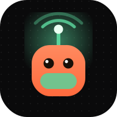
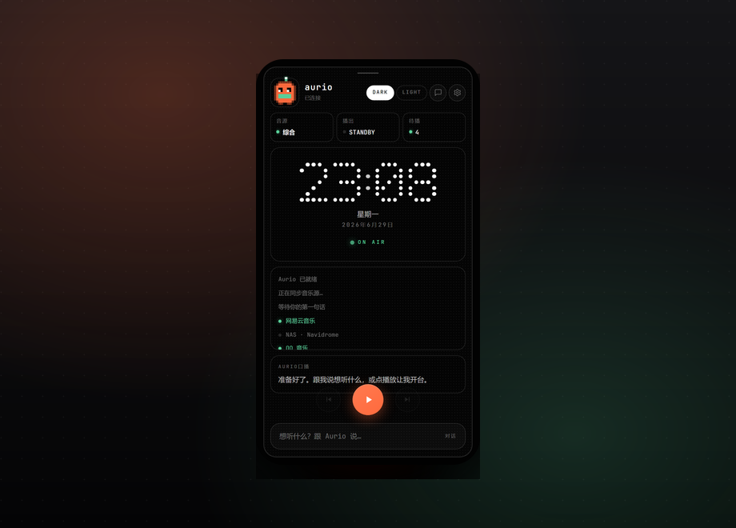
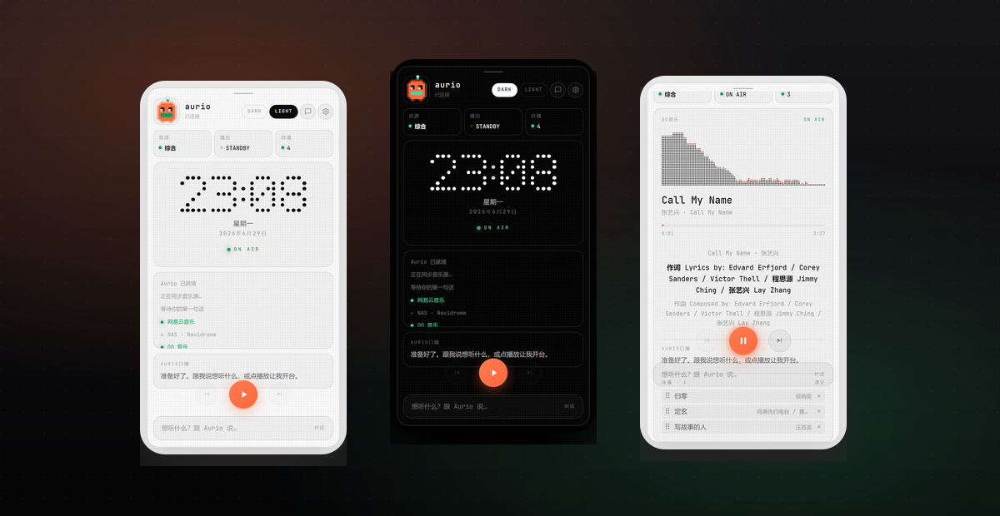
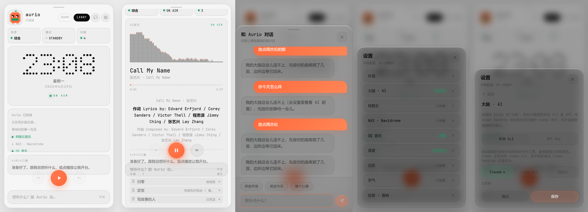
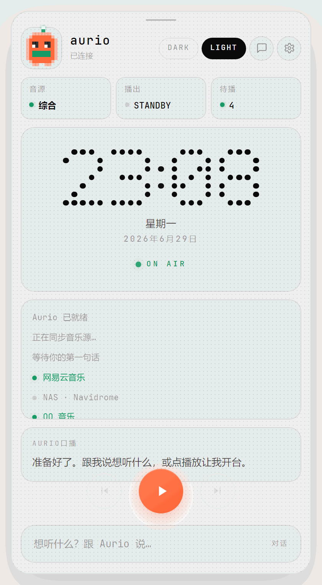
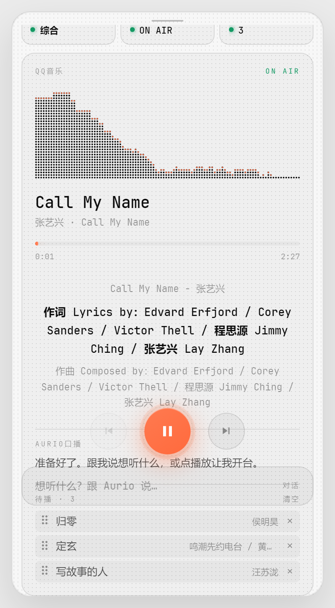
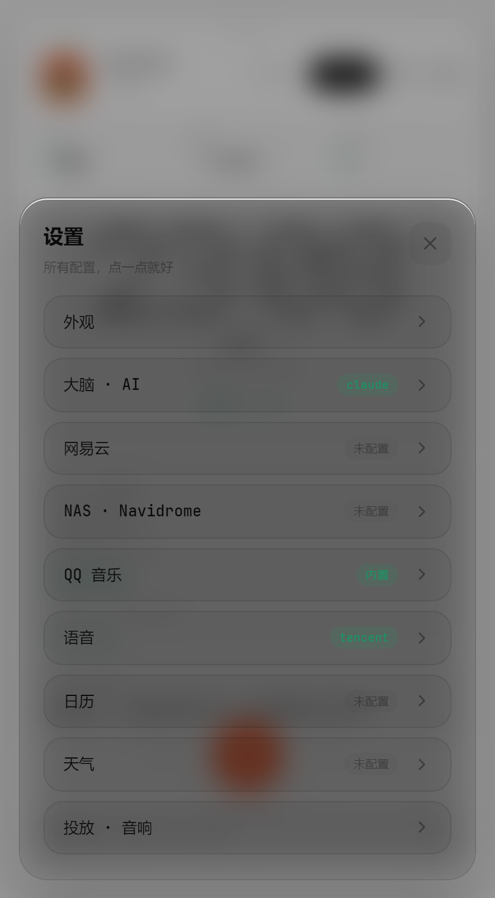
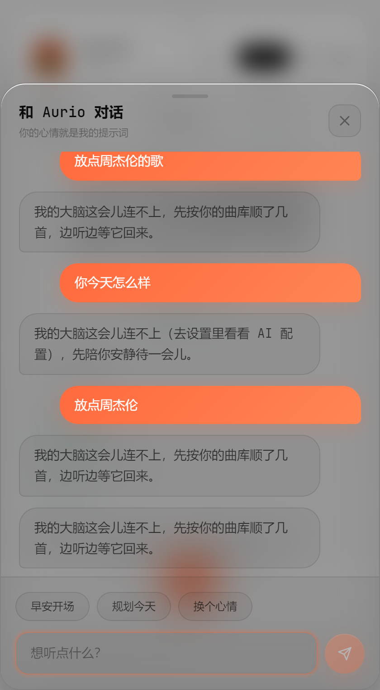
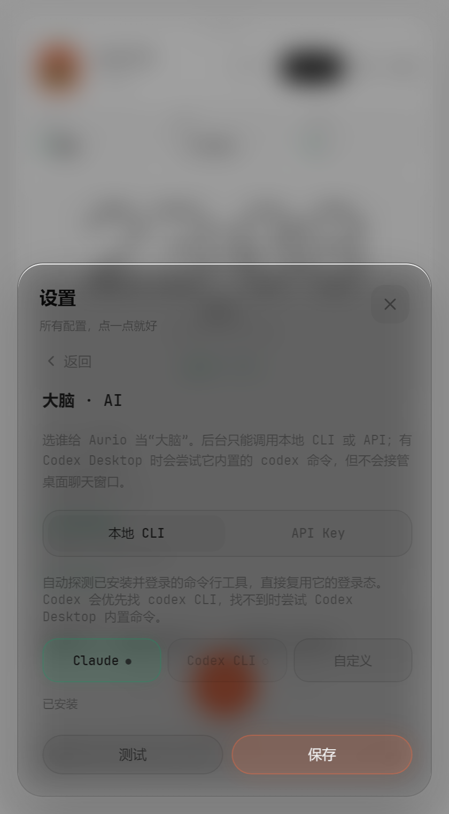
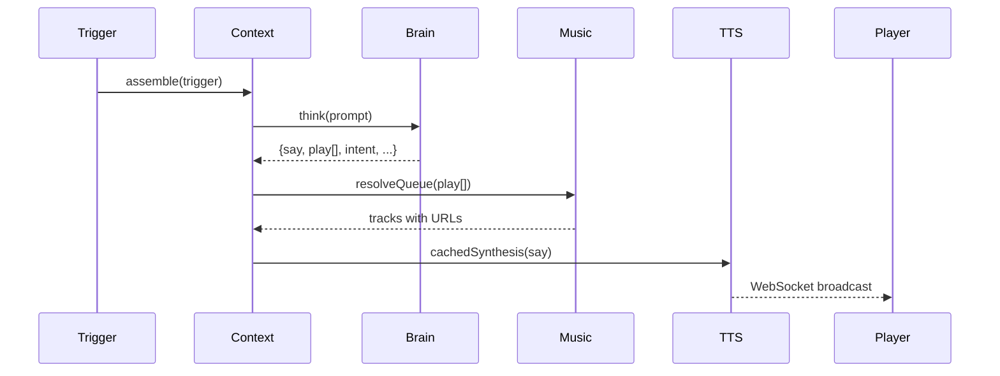

<p align="right"><strong><a href="README_zh.md">简体中文</a></strong></p>

<div align="center">



# Aurio

**Your personal AI radio.**

*Context-aware · library-native · locally hosted.*

<br />

[](CHANGELOG.md)
[](LICENSE)
[](package.json)
[](package.json)
[](web/package.json)
[](https://github.com/baogutang/aurio/actions)

<br />

**[Quick Start](#quick-start)** · **[API Relay](#api-relay)** · **[Screenshots](#screenshots)** · **[Architecture](#architecture)** · **[Docs](#documentation)**

<br />

<a href="https://github.com/baogutang/aurio/releases/latest"></a>
<a href="https://github.com/baogutang/aurio/releases/latest"></a>
<a href="https://github.com/baogutang/aurio/releases/latest"></a>

</div>

<br />

<table>
<tr>
<td width="72" align="center"></td>
<td>

**Recommended API relay** — OpenAI-compatible endpoint maintained by the author.  
Plug into **Settings → Brain · AI → API Key**, or use `.env` below.

<br />

<a href="https://token.baogutang.top"></a>

</td>
</tr>
</table>

<br />

<picture>
  <source media="(prefers-color-scheme: dark)" srcset="assets/hero-banner.png" />
  
</picture>

<p align="center">
  <sub>Electron desktop · browser PWA · 420×760 player · dark / light themes</sub>
</p>

<p align="center">
  <sub>
    <strong>Works with</strong>
    &nbsp; Claude · Codex · OpenAI-compatible APIs
    &nbsp;·&nbsp; Navidrome · NetEase · QQ Music
    &nbsp;·&nbsp; macOS Calendar · ICS · OpenWeather
    &nbsp;·&nbsp; UPnP / DLNA
  </sub>
</p>

---

## At a glance

> **Not a playlist app.** Not a chatbot.  
> A local AI DJ that pulls real tracks from your libraries, reads your day, and speaks between songs.

<table>
<tr>
<td align="center" width="33%"><strong>Library-native</strong><br/><sub>Navidrome · NetEase · QQ</sub></td>
<td align="center" width="33%"><strong>Context-aware</strong><br/><sub>Calendar · weather · taste corpus</sub></td>
<td align="center" width="33%"><strong>Locally hosted</strong><br/><sub>Loopback API · disk-cached TTS</sub></td>
</tr>
</table>

---

## See it in action

<p align="center">
  
</p>

<p align="center">
  
</p>

<p align="center">
  
</p>

<p align="center"><sub>Standby → On-air → Chat → Settings → Brain</sub></p>

---

## Why Aurio

Streaming apps optimize for engagement. Playlists demand curation. **Aurio is a third path** — a radio host that runs on your machine, knows your day, and picks from **your** libraries.

| | Algorithmic streaming | Aurio |
|:--|:--|:--|
| Music source | Platform catalog | Your NAS + NetEase + QQ |
| Personality | None | Editable taste corpus + DJ persona |
| Context | Opaque | Calendar · weather · time-of-day |
| Voice | None | System / Tencent / Fish TTS |
| Privacy | Cloud-first | Local server · loopback API by default |

### Design principles

| Principle | What it means |
|:--|:--|
| **Local-first** | Brain, queue, TTS cache, and settings live on your machine — cloud is optional |
| **Context-native** | Every segment assembles persona, taste, weather, calendar, and play history before the AI speaks |
| **Library-grounded** | Tracks resolve against real libraries, not hallucinated titles |

---

## A day on the air

Aurio doesn't wait for you to press play. Scheduled beats keep the show alive:

| Time | Beat | What happens |
|:--|:--|:--|
| **07:00** | `plan` | Day plan segment — sets the arc for what's ahead |
| **09:00** | `morning` | Morning open — weather, calendar, first picks |
| **10:00–23:00** | `mood` | Hourly mood check — append new segments to the queue |
| **Anytime** | `open` | Radio engine refills when the queue runs low |
| **On demand** | `chat` | *"Play something jazzy"* — enqueue, steer mood, or talk-only |

---

## What you get

<details>
<summary><strong>Intelligence</strong></summary>

| | Capability | Detail |
|:--|:--|:--|
| 🧠 | **AI brain** | Claude / Codex CLI, or any OpenAI-compatible API |
| 📅 | **Context engine** | Weather, macOS Calendar, ICS feeds in every segment |
| 💬 | **Chat to steer** | *"Play some Jay Chou"* — enqueue, mood shift, or talk-only |
| ⏰ | **Scheduled show** | 07:00 plan · 09:00 morning · hourly mood 10–23 |

</details>

<details>
<summary><strong>Music & broadcast</strong></summary>

| | Capability | Detail |
|:--|:--|:--|
| 🎵 | **Multi-source music** | Navidrome · NetEase (QR) · QQ — search, queue, lyrics |
| 🎙️ | **Voice** | macOS `say` · Windows SAPI · Tencent · Fish — disk-cached |
| 📻 | **Radio engine** | Auto-refills queue via WebSocket when tracks run low |
| 🔊 | **UPnP cast** | DLNA speakers on your LAN |

</details>

<details>
<summary><strong>Platform</strong></summary>

| | Capability | Detail |
|:--|:--|:--|
| 🛡️ | **Secure default** | Control API loopback-only; media proxies LAN-ready for casting |
| 🖥️ | **Cross-platform** | Electron desktop + browser PWA from one server |

</details>

---

## API relay

Don't want to wrangle CLI logins? Use the author-maintained relay:

### **[token.baogutang.top](https://token.baogutang.top)**

```bash
AI_PROVIDER=api
AI_API_KIND=openai
AI_API_BASE_URL=https://token.baogutang.top/v1   # use the exact base URL on the portal
AI_API_MODEL=your-model-id
AI_API_KEY=your-key-from-portal
```

Or configure in-app: **Settings → Brain · AI → API Key**.  
CLI mode (Claude / Codex) still works with zero API key — the relay is optional.

---

## Screenshots

<p align="center">
  
  &nbsp;&nbsp;
  
</p>

<p align="center">
  
  &nbsp;&nbsp;
  
  &nbsp;&nbsp;
  
</p>

<details>
<summary><strong>UI notes</strong></summary>

- Dot-matrix clock standby with live service strip (NetEase · Navidrome · QQ)
- Spectrum + synced lyrics; drag-and-drop **Up Next** queue
- Glass-morphism sheets with Framer Motion spring physics
- Monospace Nerd Font UI · accent `#ff6a3d` / `#5ad19a` · dark / light themes

</details>

---

## Quick start

**Requires Node.js 20+ · macOS, Windows, or Linux**

Prefer packaged builds? Grab the latest **macOS**, **Windows**, or **Linux** installer from [Releases](https://github.com/baogutang/aurio/releases/latest).

| Step | Command |
|:--:|:--|
| **1** | `git clone https://github.com/baogutang/aurio.git && cd aurio && npm install` |
| **2** | `cp .env.example .env` — every key is optional |
| **3** | `npm run server` → open `http://localhost:8080` |
| **4** | `npm start` — Electron desktop (optional) |

First launch opens an onboarding wizard (AI → music → voice). Reconfigure anytime in **Settings**.

```bash
npm run dist:mac        # macOS .dmg + .zip
npm run dist:win        # Windows NSIS + portable
cd web && npm run dev   # frontend HMR
```

---

## Architecture

<p align="center">
  
</p>

<p align="center">
  
</p>

```
Trigger → context.js → brain/ → music/ → tts/ → WebSocket → React player
```

<details>
<summary><strong>Segment pipeline (sequence)</strong></summary>



Each beat returns `{ say, play[], reason, segue, intent, placement, mood }`.  
→ [docs/architecture.md](docs/architecture.md)

</details>

<details>
<summary><strong>Tech stack</strong></summary>

| Layer | Stack |
|:--|:--|
| Desktop | Electron 33 |
| Frontend | React 18 · Vite · Tailwind · Framer Motion |
| Server | Node.js 20 · Express · WebSocket |
| Brain | Claude / Codex CLI · OpenAI-compatible API |
| Music | Navidrome (Subsonic) · NetEase API · QQ Music |
| Voice | macOS `say` · Tencent Cloud · Fish Audio |
| Cast | UPnP / DLNA via native SSDP discovery |

</details>

---

## Configuration

Copy [`.env.example`](.env.example) → `.env`. In-app changes persist to `data/settings.json`.

| Variable | Purpose |
|:--|:--|
| `PORT` | Server port (default `8080`) |
| `AURIO_ALLOW_LAN` | Open control API to LAN (default `false`) |
| `AI_PROVIDER` | `claude` · `codex` · `cli` · `api` |
| `AI_API_*` | Hosted model / [relay](https://token.baogutang.top) |
| `NAVIDROME_*` | NAS music library |
| `NETEASE_COOKIE` | Auto-filled after QR login |
| `VOICE_PROVIDER` | `system` · `tencent` · `fish` |

---

## Usage

| Goal | Action |
|:--|:--|
| Hands-free listening | Let cron beats run (morning open, hourly mood) |
| Start the show | Tap **Play** — radio engine refills the queue |
| Request a vibe | Chat: *"Play some Jay Chou"* · *"Change the mood"* |
| Switch source | Tap **Source** — combined / NetEase / Navidrome / QQ |
| Cast | Settings → **Cast** → DLNA device |
| Tune taste | Edit `user/taste.md`, `routines.md`, `mood-rules.md` |

```bash
curl -X POST http://localhost:8080/api/chat \
  -H 'Content-Type: application/json' \
  -d '{"text": "something mellow"}'
```

→ [examples/api.md](examples/api.md)

---

## Documentation

| Topic | Link |
|:--|:--|
| Architecture | [docs/architecture.md](docs/architecture.md) |
| Frontend spec | [docs/FRONTEND_SPEC.md](docs/FRONTEND_SPEC.md) |
| Security model | [SECURITY.md](SECURITY.md) |
| Changelog | [CHANGELOG.md](CHANGELOG.md) |
| Contributing | [CONTRIBUTING.md](CONTRIBUTING.md) |
| Social preview | [PNG](.github/social-preview.png) · [SVG source](.github/social-preview.svg) |

Regenerate README media (server must be running):

```bash
node scripts/capture-readme-assets.mjs
```

---

## Development

```bash
npm run server       # backend only
npm test             # vitest (19 tests)
cd web && npm run build
```

---

## FAQ

<details>
<summary><strong>Do I need an API key?</strong></summary>

No. Default brain uses your local Claude or Codex CLI. API mode — including the <a href="https://token.baogutang.top">author relay</a> — is optional.

</details>

<details>
<summary><strong>Brain shows <code>unavailable</code></strong></summary>

Verify `claude --version` or `codex --version` in terminal. For API mode, check Base URL + key under Settings → Brain · AI.

</details>

<details>
<summary><strong>Without Navidrome?</strong></summary>

Yes. NetEase and QQ search work out of the box. NetEase playback needs QR login in Settings.

</details>

<details>
<summary><strong>Browser only?</strong></summary>

Yes — `npm run server` serves the PWA at `http://localhost:8080`.

</details>

---

## License

[MIT](LICENSE) © 2026 Aurio contributors

---

<div align="center">

**Built by [baogutang](https://github.com/baogutang)**

AI relay → **[token.baogutang.top](https://token.baogutang.top)**

<br />

[](https://star-history.com/#baogutang/aurio&Date)

</div>
