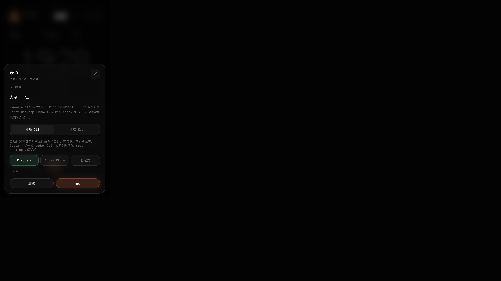
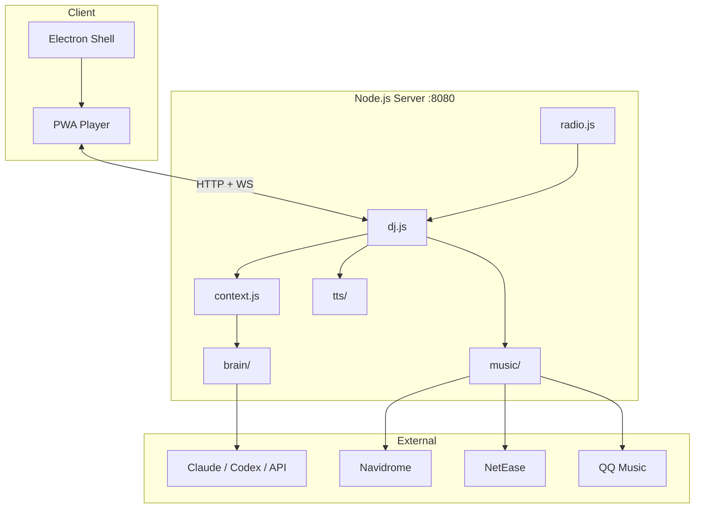
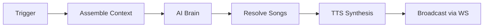

<div align="center">


# Aurio

**Your personal AI radio — it knows your schedule, your library, and what you feel like hearing.**

[](LICENSE)
[](package.json)
[](package.json)
[](web/package.json)
[](#installation)

[Quick Start](#quick-start) · [Features](#features) · [Architecture](#architecture) · [API](examples/api.md) · [Contributing](CONTRIBUTING.md)


<sub>Desktop player at 420×760 · also runs in any browser as a PWA</sub>

</div>

---

## Why

Streaming apps play algorithms. Playlists need manual curation. Aurio is different: a **local AI DJ** that reads your calendar, weather, listening history, and taste notes — then picks real songs from **your** libraries and talks between tracks like a radio host.

| Pain point | How Aurio helps |
|------------|-----------------|
| "I don't know what to play" | AI segments with context-aware song picks |
| "Algorithms don't know me" | Your Navidrome NAS, NetEase, QQ library + `user/taste.md` |
| "I want ambience, not a chatbot" | Scheduled beats (morning open, hourly mood) + always-on radio mode |
| "I don't want another cloud subscription" | Local CLI brain (Claude / Codex login) or bring your own API key |

**Who is it for?** Music lovers with a personal library (NAS or streaming accounts) who want a hands-free, context-aware listening experience on macOS or Windows.

---

## Features

| | Feature | Description |
|---|---------|-------------|
| 🧠 | **AI DJ Brain** | Local Claude / Codex CLI or API (GLM, DeepSeek, Kimi, OpenAI, Anthropic) |
| 🎵 | **Multi-source Music** | Navidrome (Subsonic), NetEase Cloud Music, QQ Music — unified search & queue |
| 🎙️ | **Voice Synthesis** | System TTS (macOS `say` · Windows SAPI), Tencent Cloud, Fish Audio — cached locally |
| 📅 | **Context-aware** | Weather, macOS Calendar, ICS import/subscribe feed into every segment |
| ⏰ | **Scheduled Show** | 07:00 daily plan · 09:00 morning open · hourly mood checks 10–23 |
| 💬 | **Chat to Request** | "来点爵士" — intent-based enqueue, steer, or talk-only |
| 📻 | **Radio Engine** | Auto-refills queue via WebSocket heartbeat when tracks run low |
| 🔊 | **UPnP Cast** | Stream music to DLNA home speakers |
| ⚙️ | **Settings UI** | Configure everything in-app — first-run onboarding included |
| 🖥️ | **Cross-platform** | Electron desktop app + browser PWA from the same server |

---

## Demo

> GIF placeholder — record using [demo/RECORDING.md](demo/RECORDING.md), save to `assets/demo.gif`.

<!-- Uncomment after recording:

-->

---

## Screenshots

| Home (standby) | Settings |
|:---:|:---:|
|  |  |

| AI Brain config | Chat |
|:---:|:---:|
|  |  |

---

## Architecture

```
Electron / Browser
       │
       ▼
  Node.js Server ──► brain/ (CLI or API)
       │              music/ (Navidrome · NetEase · QQ)
       │              tts/ (system · Tencent · Fish)
       │              context.js → 6 prompt fragments
       │              scheduler.js → cron beats
       ▼
  PWA Player (React)  ◄── WebSocket /stream
```

<details>
<summary><strong>System diagram (Mermaid)</strong></summary>



</details>

<details>
<summary><strong>AI segment pipeline</strong></summary>



Each segment returns `{ say, play[], reason, segue, intent, placement, mood }`.

</details>

Full details: [docs/architecture.md](docs/architecture.md)

---

## Tech Stack

| Layer | Technology |
|-------|------------|
| **Runtime** | Node.js 20+ (ES modules) |
| **Desktop** | Electron 33, electron-builder |
| **Backend** | Express, ws, node-cron, dotenv |
| **Frontend** | React 18, TypeScript, Vite, Tailwind CSS, Framer Motion |
| **AI** | Claude CLI · Codex CLI · OpenAI-compatible / Anthropic APIs |
| **Music** | Subsonic (Navidrome), NeteaseCloudMusicApi, QQ public adapter |
| **TTS** | System (macOS `say` · Windows SAPI/System.Speech), Tencent Cloud TTS, Fish Audio |
| **Cast** | node-ssdp, upnp-mediarenderer-client |
| **Storage** | JSON files (`data/state.json`, `data/settings.json`) |

---

## Project Structure

```
aurio/
├── electron/          # Desktop shell (spawns server, loads PWA)
├── server/            # API, DJ orchestration, integrations
│   ├── brain/         # AI providers (CLI + API)
│   ├── music/         # Navidrome, NetEase, QQ adapters
│   ├── tts/           # Voice synthesis + cache
│   ├── calendar/      # macOS, ICS, Feishu hooks
│   ├── cast/          # UPnP/DLNA
│   ├── dj.js          # Segment composer & broadcaster
│   ├── context.js     # Prompt assembly
│   ├── radio.js       # Auto-refill engine
│   └── index.js       # HTTP + WebSocket entry
├── web/               # React frontend source
├── pwa/               # Built player (served statically)
├── prompts/           # DJ persona template
├── user/              # Taste / routine templates (editable)
├── assets/            # Logo, diagrams, hero images
├── screenshots/       # README screenshots
├── docs/              # Architecture & frontend spec
└── examples/          # API usage examples
```

---

## Installation

### Prerequisites

- **Node.js 20+**
- **macOS or Windows** (Linux: server + browser work; Electron packaging untested)
- Optional: Claude Code CLI or Codex CLI (logged in), or an API key
- Optional: Navidrome instance, Tencent/Fish/OpenWeather keys

### Setup

```bash
git clone https://github.com/baogutang/aurio.git
cd aurio
npm install

cp .env.example .env
# All keys are optional — missing integrations stay disabled
```

---

## Quick Start

```bash
# Server + PWA in browser
npm run server
# → http://localhost:8080

# Desktop app (Electron + embedded server)
npm start
```

On first launch, the onboarding wizard guides you through AI, music, and voice setup. Everything can also be configured later in **设置**.

### Build installable packages

```bash
npm run dist:mac   # macOS .dmg + .zip (run on macOS)
npm run dist:win   # Windows NSIS + portable
```

Output: `release/`

### Frontend development

```bash
cd web && npm install && npm run dev   # Vite dev server
cd web && npm run build                # Rebuild pwa/
```

---

## Configuration

Copy `.env.example` to `.env`. Settings can also be changed in-app and are persisted to `data/settings.json`.

| Variable | Required | Purpose |
|----------|----------|---------|
| `PORT` | No | Server port (default `8080`) |
| `AI_PROVIDER` | No | `claude` · `codex` · `cli` · `api` |
| `AI_API_KEY` | If `api` | Hosted model key |
| `NAVIDROME_URL/USER/PASS` | No | Your NAS music library |
| `NETEASE_COOKIE` | No | Auto-filled after QR login in-app |
| `QQ_COOKIE` | No | Optional QQ playback entitlement |
| `VOICE_PROVIDER` | No | `system` · `tencent` · `fish` |
| `OPENWEATHER_KEY` | No | Weather context |
| `CALENDAR_ICS_URLS` | No | ICS subscription URLs |

See [.env.example](.env.example) for the complete list.

---

## Usage

### Typical workflows

1. **Let it run** — Aurio schedules morning opens and hourly mood checks automatically.
2. **Press play** — Starts the radio; the engine refills the queue as you listen.
3. **Chat** — "放首周杰伦" or "换个心情" for on-demand segments.
4. **Switch source** — Tap **音源** to cycle combined / NetEase / Navidrome / QQ.
5. **Cast** — Settings → 投放 · 音响 to play on DLNA speakers.

### API & WebSocket

```bash
# Talk to the DJ
curl -X POST http://localhost:8080/api/chat \
  -H 'Content-Type: application/json' \
  -d '{"text": "来点轻松的"}'
```

More examples: [examples/api.md](examples/api.md)

### Customize taste

Edit files in `user/`:

- `taste.md` — genre preferences, artists you love
- `routines.md` — daily listening patterns
- `mood-rules.md` — time-of-day mood mapping
- `playlists.json` — named playlist hints

---

## Development

```bash
npm run server              # Backend only
cd web && npm run dev       # Frontend hot reload
cd web && npm run build     # Ship to pwa/
```

| Topic | Location |
|-------|----------|
| Frontend contract | [docs/FRONTEND_SPEC.md](docs/FRONTEND_SPEC.md) |
| Architecture | [docs/architecture.md](docs/architecture.md) |
| Contributing | [CONTRIBUTING.md](CONTRIBUTING.md) |

No test runner or linter is configured in this repository yet.

---

## Performance

Built-in optimizations present in the codebase:

- **TTS disk cache** — repeated patter served from `cache/tts/`
- **Same-origin stream proxies** — enables Web Audio spectrum without CORS issues
- **Debounced state saves** — `data/state.json` written on a 300ms timer
- **Background TTS synthesis** — patter can broadcast before audio is ready; URL patched via WebSocket
- **Queue deduplication** — prevents duplicate tracks in the live queue

No published benchmarks exist.

---

## Security

Aurio is **local-first**: the server defaults to localhost, credentials live in `data/settings.json` (gitignored), and stream proxies hide upstream credentials from the browser.

See [SECURITY.md](SECURITY.md) for the full security model and vulnerability reporting.

---

## Roadmap

| Status | Item |
|--------|------|
| ✅ Shipped | Electron + server + PWA player |
| ✅ Shipped | Navidrome, NetEase (QR login), QQ Music |
| ✅ Shipped | CLI + API brain, TTS, weather, calendars, UPnP |
| ✅ Shipped | In-app settings + onboarding |
| ✅ Shipped | CI build workflow (GitHub Actions) |
| ⏳ Planned | DingTalk / WeCom native OAuth |
| ⏳ Planned | TTS voiceover via UPnP cast |
| ⏳ Planned | Automated tests |

---

## FAQ

**Do I need an API key?**  
No. Default brain uses your local `claude` CLI login. API mode is optional.

**Why does the brain show `unavailable`?**  
Verify `claude --version` or `codex --version` works in terminal. On macOS with only Codex Desktop, Aurio tries `/Applications/Codex.app/Contents/Resources/codex`.

**`401 Invalid bearer token` with Claude CLI?**  
Set `CLAUDE_FORCE_LOGIN=true` in `.env` to ignore stray `ANTHROPIC_API_KEY` env vars.

**Can I use it without Navidrome?**  
Yes. NetEase and QQ search work out of the box. NetEase playback requires QR login in Settings.

**Where is state stored?**  
`data/state.json` (queue, history), `data/settings.json` (credentials), `cache/tts/` (voice cache). All gitignored.

**Does it work in a browser without Electron?**  
Yes. `npm run server` serves the PWA at `http://localhost:8080`. Install as PWA from the browser if supported.

---

## Contributing

Contributions welcome! See [CONTRIBUTING.md](CONTRIBUTING.md) and [CODE_OF_CONDUCT.md](CODE_OF_CONDUCT.md).

---

## License

[MIT](LICENSE) © 2026 Aurio contributors

---

## Acknowledgements

- [Navidrome](https://www.navidrome.org/) — self-hosted music server
- [NeteaseCloudMusicApi](https://github.com/Binaryify/NeteaseCloudMusicApi) — NetEase integration
- [Electron](https://www.electronjs.org/) — cross-platform desktop shell

---

## Star History

[](https://star-history.com/#baogutang/aurio&Date)

---

## Contributors

Contributors are welcome. This section will list contributors as the project grows.

<!-- ALL-CONTRIBUTORS-LIST:START -->
<!-- ALL-CONTRIBUTORS-LIST:END -->
