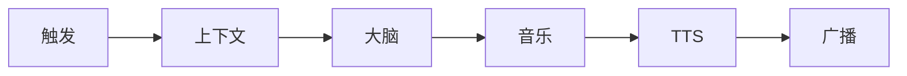

<p align="right"><strong><a href="README.md">English</a></strong></p>

<div align="center">


# Aurio

*你的私人 AI 电台 —— 懂上下文、连真曲库、跑在本地。*

[](LICENSE)
[](package.json)
[](package.json)
[](web/package.json)
[](https://github.com/baogutang/aurio/actions)

<br />

**[快速开始](#快速开始)** · **[API 中转站](#api-中转站)** · **[界面一览](#界面一览)** · **[架构](#架构)** · **[文档](#文档)**

</div>

<br />

<table>
<tr>
<td width="72" align="center"></td>
<td>

**推荐 API 中转站** —— 作者维护的 OpenAI 兼容接口，专为 Aurio 大脑场景优化。  
在 **设置 → 大脑 · AI → API Key** 填入，或使用下方 `.env` 配置。

<br />

<a href="https://token.baogutang.top"></a>

</td>
</tr>
</table>

<br />

<picture>
  <source media="(prefers-color-scheme: dark)" srcset="assets/hero-banner.png" />
  
</picture>

<p align="center"><sub>Electron · 浏览器 PWA · 420×760 播放器 · 深色 / 浅色主题</sub></p>

---

## 一眼看懂

| | | |
|:--|:--|:--|
| **不是歌单 App** | **不是聊天机器人** | **是本地 AI 电台** |
| 从 Navidrome、网易云、QQ 拉真歌 | 曲目之间口播，TTS 本地缓存 | 读日历、天气和 `user/taste.md` 再开口 |

---

## 产品演示

<p align="center">
  
</p>

<p align="center">
  
</p>

<p align="center"><sub>待机 → 播出 → 对话 → 设置 → 大脑</sub></p>

---

## 为什么做 Aurio

流媒体推算法，歌单靠手搓。**Aurio 走第三条路**：跑在你电脑上的电台主持人，懂你的日程，从你的曲库里选歌。

| | 算法流媒体 | Aurio |
|:--|:--|:--|
| 曲库 | 平台黑盒 | NAS + 网易云 + QQ |
| 人格 | 无 | 可编辑品味文档 + DJ 人设 |
| 上下文 | 不透明 | 日历 · 天气 · 时段 |
| 口播 | 无 | 系统 / 腾讯 / Fish 语音 |
| 隐私 | 云端优先 | 本地服务 · 控制面默认 localhost |

---

## 核心能力

| | 功能 | 说明 |
|:--|:--|:--|
| 🧠 | **AI 大脑** | Claude / Codex CLI，或任意 OpenAI 兼容 API |
| 🎵 | **多音源** | Navidrome · 网易云（扫码）· QQ — 搜索、队列、歌词 |
| 🎙️ | **语音合成** | macOS `say` · Windows SAPI · 腾讯云 · Fish |
| 📅 | **情境引擎** | 天气、系统日历、ICS 订阅注入每次口播 |
| ⏰ | **定时节目** | 07:00 日计划 · 09:00 早安 · 10–23 整点心情 |
| 💬 | **对话点播** | 「来点爵士」— 插播、换 mood、纯聊天 |
| 📻 | **电台引擎** | 队列见底 WebSocket 自动补货 |
| 🔊 | **UPnP 投放** | DLNA 音响局域网播放 |
| 🛡️ | **默认安全** | 控制 API 仅本机；投屏媒体代理可局域网访问 |
| 🖥️ | **跨平台** | Electron 桌面 + 浏览器 PWA 同一套 UI |

---

## API 中转站

不想折腾 CLI 登录？用作者维护的中转站：

### **[token.baogutang.top](https://token.baogutang.top)**

```bash
AI_PROVIDER=api
AI_API_KIND=openai
AI_API_BASE_URL=https://token.baogutang.top/v1   # 以站点显示的实际 Base URL 为准
AI_API_MODEL=your-model-id
AI_API_KEY=your-key-from-portal
```

也可在 **设置 → 大脑 · AI → API Key** 中直接填写。  
本地 CLI（Claude / Codex）无需 API Key —— 中转站是可选增强。

---

## 界面一览

<p align="center">
  
  &nbsp;&nbsp;
  
</p>

<p align="center">
  
  &nbsp;&nbsp;
  
  &nbsp;&nbsp;
  
</p>

<details>
<summary><strong>界面细节</strong></summary>

- 点阵时钟待机，音源状态条（网易云 · Navidrome · QQ）
- 播出频谱 + 歌词同步；**待播队列**可拖拽排序
- 毛玻璃面板 + Framer Motion 弹簧动效
- Nerd Font 等宽 UI · 强调色 `#ff6a3d` / `#5ad19a` · 深 / 浅双主题

</details>

---

## 快速开始

**需要 Node.js 20+ · macOS 或 Windows**

```bash
git clone https://github.com/baogutang/aurio.git
cd aurio && npm install
cp .env.example .env    # 所有配置均可选
npm run server          # → http://localhost:8080
npm start               # Electron 桌面版
```

首次启动有引导向导（AI → 音乐 → 语音），之后随时在 **设置** 里改。

```bash
npm run dist:mac        # macOS .dmg + .zip
npm run dist:win        # Windows NSIS + portable
cd web && npm run dev   # 前端热更新
```

---

## 架构

<p align="center">
  
</p>

```
触发 → context.js → brain/ → music/ → tts/ → WebSocket → React 播放器
```

<details>
<summary><strong>节目流水线</strong></summary>



每次 beat 返回 `{ say, play[], reason, segue, intent, placement, mood }`。  
→ [docs/architecture.md](docs/architecture.md)

</details>

---

## 配置

复制 [`.env.example`](.env.example) → `.env`。应用内修改会写入 `data/settings.json`。

| 变量 | 用途 |
|:--|:--|
| `PORT` | 服务端口（默认 `8080`） |
| `AURIO_ALLOW_LAN` | 向局域网开放控制 API（默认 `false`） |
| `AI_PROVIDER` | `claude` · `codex` · `cli` · `api` |
| `AI_API_*` | 托管模型 / [中转站](https://token.baogutang.top) |
| `NAVIDROME_*` | NAS 曲库 |
| `NETEASE_COOKIE` | 扫码登录后自动填入 |
| `VOICE_PROVIDER` | `system` · `tencent` · `fish` |

---

## 使用

| 场景 | 操作 |
|:--|:--|
| 放手听 | 让定时 beat 自动跑（早安、整点心情） |
| 开台 | 点 **播放** —— 电台引擎自动补队列 |
| 点播 | 对话：「放首周杰伦」「换个心情」 |
| 切音源 | 点 **音源** —— 综合 / 网易云 / Navidrome / QQ |
| 投放 | 设置 → **投放 · 音响** → DLNA 设备 |
| 调品味 | 编辑 `user/taste.md`、`routines.md`、`mood-rules.md` |

```bash
curl -X POST http://localhost:8080/api/chat \
  -H 'Content-Type: application/json' \
  -d '{"text": "来点轻松的"}'
```

→ [examples/api.md](examples/api.md)

---

## 文档

| 主题 | 链接 |
|:--|:--|
| 架构 | [docs/architecture.md](docs/architecture.md) |
| 前端规范 | [docs/FRONTEND_SPEC.md](docs/FRONTEND_SPEC.md) |
| 安全模型 | [SECURITY.md](SECURITY.md) |
| 贡献指南 | [CONTRIBUTING.md](CONTRIBUTING.md) |

重新生成 README 素材（需先启动服务）：

```bash
node scripts/capture-readme-assets.mjs
```

---

## 开发

```bash
npm run server       # 仅后端
npm test             # vitest（19 个测试）
cd web && npm run build
```

---

## 常见问题

<details>
<summary><strong>必须要 API Key 吗？</strong></summary>

不需要。默认走本地 Claude / Codex CLI。<a href="https://token.baogutang.top">作者中转站</a> 是可选的 API 模式。

</details>

<details>
<summary><strong>大脑显示 <code>unavailable</code></strong></summary>

终端确认 `claude --version` 或 `codex --version` 可用。纯 API 模式检查设置里的 Base URL 和密钥。

</details>

<details>
<summary><strong>没有 Navidrome 能用吗？</strong></summary>

可以。网易云和 QQ 搜索开箱即用；网易云播放需在设置里扫码登录。

</details>

<details>
<summary><strong>只用浏览器？</strong></summary>

可以 —— `npm run server` 后访问 `http://localhost:8080`。

</details>

---

## 许可证

[MIT](LICENSE) © 2026 Aurio contributors

---

<div align="center">

**作者 [baogutang](https://github.com/baogutang)** · API 中转站 → **[token.baogutang.top](https://token.baogutang.top)**

<br />

[](https://star-history.com/#baogutang/aurio&Date)

</div>
