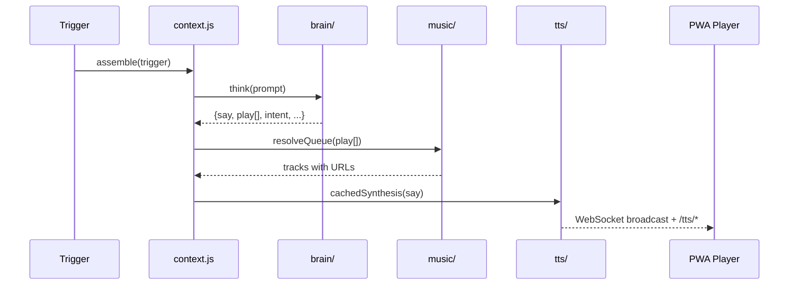

# Architecture

Technical overview of Aurio's runtime architecture. All descriptions reflect the current codebase.

## High-Level Overview

```
Electron (optional)          Browser / PWA
       │                          │
       └──────────┬───────────────┘
                  ▼
         Node.js Server (server/)
                  │
    ┌─────────────┼─────────────┐
    ▼             ▼             ▼
  brain/       music/         tts/
    │             │             │
    ▼             ▼             ▼
 CLI / API   Navidrome /     System /
             NetEase / QQ    Tencent / Fish
```


## Runtime Entry Points

| Entry | File | Command |
|-------|------|---------|
| Desktop app | `electron/main.js` | `npm start` |
| Server only | `server/index.js` | `npm run server` |
| Frontend dev | `web/src/main.tsx` | `cd web && npm run dev` |
| Frontend build | `web/vite.config.ts` | `cd web && npm run build` → `pwa/` |

## Show Segment Pipeline

Each "beat" of the radio show follows the same pipeline:




### Triggers

| Kind | Source | Mode |
|------|--------|------|
| `chat` | `POST /api/chat` | `auto` — intent-based insert/chat/steer |
| `plan` | Cron 07:00 | `replace` |
| `morning` | Cron 09:00 | `replace` |
| `mood` | Cron hourly 10–23 | `append` |
| `open` | Radio engine low queue | `append` |
| Manual | `POST /api/trigger` | configurable |

## Context Assembly (`context.js`)

Six fragments are glued into one prompt:

1. **Persona** — `prompts/dj-persona.md`
2. **User corpus** — `user/taste.md`, `routines.md`, `mood-rules.md`, `playlists.json`
3. **Environment** — time, weather, today's calendar events
4. **Memory** — top/recent plays from `data/state.json`
5. **Input** — user message or trigger kind
6. **Trace** — recent DJ/user message history

The brain must return raw JSON: `{ say, play[], reason, segue, intent, placement, mood }`.

## Brain Providers (`server/brain/`)

| Provider | Config | Mechanism |
|----------|--------|-----------|
| `claude` | `AI_PROVIDER=claude` | Spawn `claude` CLI subprocess |
| `codex` | `AI_PROVIDER=codex` | Spawn `codex` CLI or Codex Desktop bundled binary |
| `cli` | `AI_PROVIDER=cli` + `AI_CLI_BIN` | Custom CLI binary |
| `api` | `AI_PROVIDER=api` | HTTP to OpenAI-compatible or Anthropic endpoints |

Presets: OpenAI, GLM, DeepSeek, Kimi, Anthropic.

## Music Layer (`server/music/`)

Unified search and playback across sources:

| Source | Module | Playback |
|--------|--------|----------|
| Navidrome | `navidrome.js` | `/api/stream/:id` proxy |
| NetEase | `netease.js` | `/api/ncm/stream/:id` proxy |
| QQ Music | `qqmusic.js` | `/api/qq/stream/:id` proxy |

`musicSource` modes: `combined`, `netease`, `navidrome`, `qqmusic`.

Same-origin proxies enable Web Audio spectrum visualization and Range seeking.

## TTS (`server/tts/`)

| Provider | Config | Notes |
|----------|--------|-------|
| `system` | `VOICE_PROVIDER=system` | macOS `say` command |
| `tencent` | Tencent Cloud credentials | Domestic cloud TTS |
| `fish` | `FISH_API_KEY` | Fish Audio fallback |

Output cached in `cache/tts/`, served at `/tts/*`.

## Real-Time Sync

- **WebSocket** `ws://localhost:8080/stream`
- Server → client: `hello`, `broadcast`, `tts`, `profile`
- Client → server: `state` heartbeat (playing index, paused, queue length)
- Heartbeat drives `radio.js` automatic queue refill

## Data Storage

| File | Contents |
|------|----------|
| `data/state.json` | Messages, play history, queue, daily plan |
| `data/settings.json` | All integration credentials (merged with `.env`) |
| `cache/tts/` | Synthesized speech files |

Packaged Electron apps use `userData` as `AURIO_DATA_DIR`.

## Scheduler (`server/scheduler.js`)

Cron jobs in host local timezone:

- `0 7 * * *` — daily plan
- `0 9 * * *` — morning open
- `0 10-23 * * *` — hourly mood check

## Deployment

```bash
npm run dist:mac   # macOS .dmg + .zip
npm run dist:win   # Windows NSIS + portable
```

Artifacts in `release/`. The build bundles `server/`, `pwa/`, `electron/`, `prompts/`, and seeds `user/` templates.

## Frontend

- Source: `web/` (React 18, TypeScript, Tailwind, Framer Motion)
- Shipped: `pwa/` (Vite build output)
- Spec: `docs/FRONTEND_SPEC.md`

The player is a vertical radio UI (~420×760) with clock standby, main card, spectrum, lyrics, chat sheet, and settings modal.
